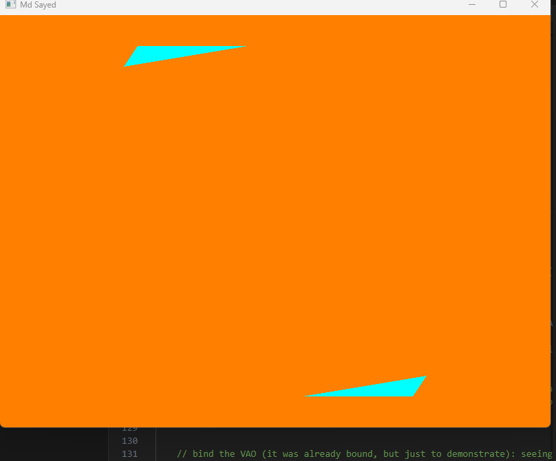

## 🎨 Assignment
Draw Two Cyan Colored Obtuse Triangles

## 📌 Assignment Requirements

This project creates an OpenGL window that:

🔷 Draws two cyan colored obtuse triangles

📍 Positions them at two distant corners of the screen

🟠 Uses an orange background

🪟 Sets the window title to MD Sayed

⌨ Closes the window when pressing the initial letter of my name (M)

## 🪟 Window Information
Feature	Value
Window Title	MD Sayed
Window Size	800 × 600
Background Color	Orange (1.0, 0.5, 0.0)
Triangle Color	Cyan (0.0, 1.0, 1.0)
Exit Key	M

## 🧠 Program Explanation

GLFW is used to create the window and manage input.

GLAD loads OpenGL function pointers.

A Vertex Shader handles triangle positioning.

A Fragment Shader sets the cyan color.

Vertex data contains coordinates for two obtuse triangles:

One in the top-left corner

One in the bottom-right corner

processInput() detects when the M key is pressed and closes the window.

## 📂 Project Structure
```
Project Folder
│
├── build/
│   └── main.exe
│
├── include/
│   ├── glad/
│   └── GLFW/
│
├── lib/
│   └── glfw3.dll
│
├── src/
│   ├── main.cpp
│   └── glad.c
│
├── Makefile
└── README.md
```

---

## ⚙️ Compilation (Windows – MinGW)
g++ src/main.cpp src/glad.c -Iinclude -Llib -lglfw3 -lopengl32 -lgdi32 -o build/main.exe


Make sure:

glfw3.dll is placed inside the build folder

MinGW is added to your system PATH

## ▶ How to Run

Open terminal inside the build folder

Run:

main.exe

## 📷 Expected Output

Orange background window titled MD Sayed

Two cyan obtuse triangles at opposite corners

Pressing M closes the window

## 🛠 Technologies Used

C++

OpenGL 3.3 Core Profile

GLFW

GLAD

MinGW (Windows)

## ✅ Notes

* The code is fully written and tested on **my own computer**
* Necessary comments are added inside the source files
* No external or copied code was used

---

## 👨‍💻 Author

MD Sayed
**ID :** **0432320005101148**
**Course:** Graphics Lab

## OUTPUT:




